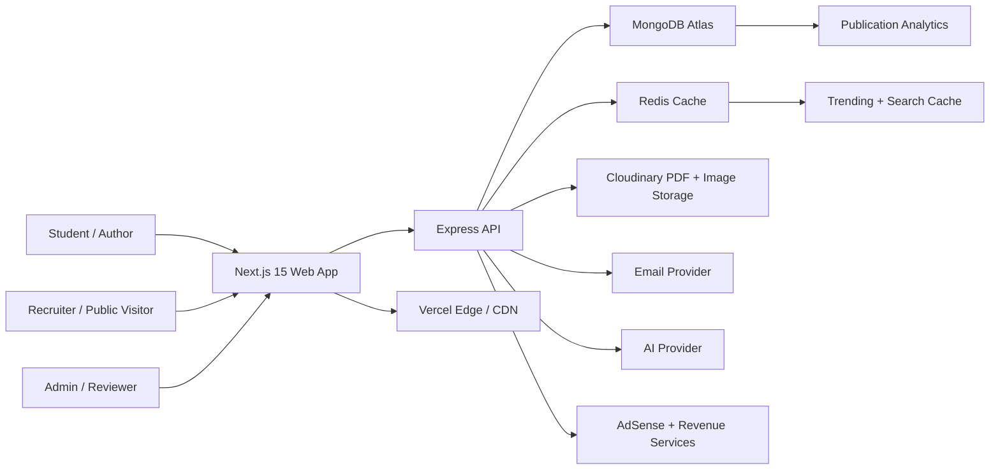

# Architecture Diagram

## Runtime Responsibilities

- Next.js renders public SEO pages, authenticated dashboards, and publishing flows.
- Express owns auth, publication workflows, analytics mutations, admin actions, AI calls, and file metadata.
- MongoDB Atlas stores user, publication, session, interaction, payment, and sponsorship state.
- Redis caches discovery lists, publication pages, and rate-sensitive analytics.
- Cloudinary stores PDFs and cover images with validation and transformation support.
- Vercel hosts the web app and edge-caches public pages.
