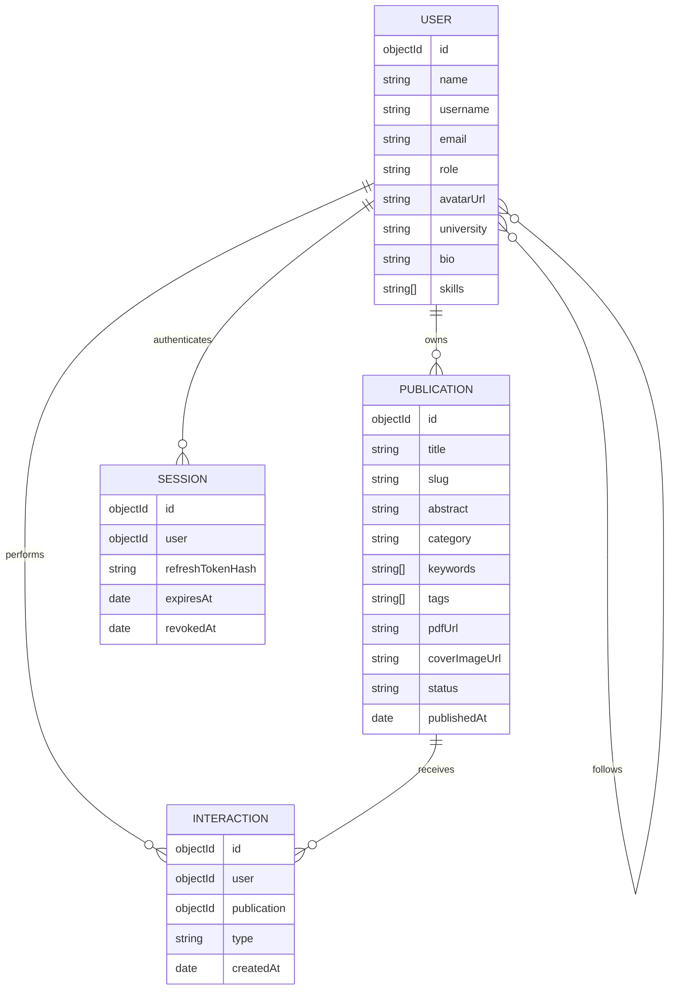

# Database ER Diagram

```mermaid
erDiagram
  USER ||--o{ PUBLICATION : owns
  USER ||--o{ SESSION : authenticates
  USER ||--o{ INTERACTION : performs
  PUBLICATION ||--o{ INTERACTION : receives
  USER }o--o{ USER : follows

  USER {
    objectId id
    string name
    string username
    string email
    string role
    string avatarUrl
    string university
    string bio
    string[] skills
  }

  PUBLICATION {
    objectId id
    string title
    string slug
    string abstract
    string category
    string[] keywords
    string[] tags
    string pdfUrl
    string coverImageUrl
    string status
    date publishedAt
  }

  SESSION {
    objectId id
    objectId user
    string refreshTokenHash
    date expiresAt
    date revokedAt
  }

  INTERACTION {
    objectId id
    objectId user
    objectId publication
    string type
    date createdAt
  }
```
